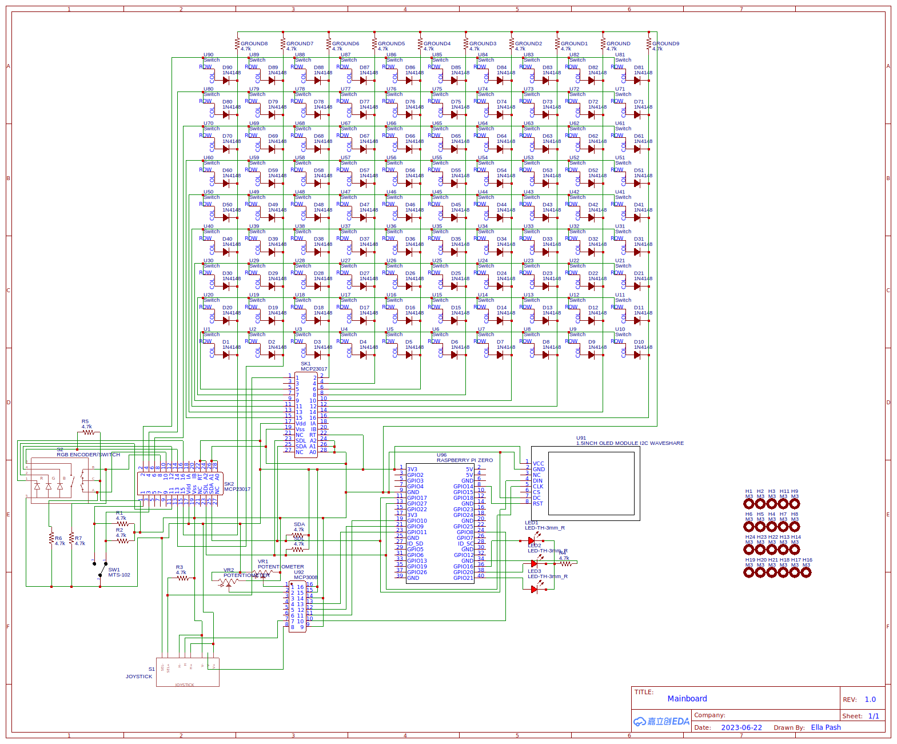
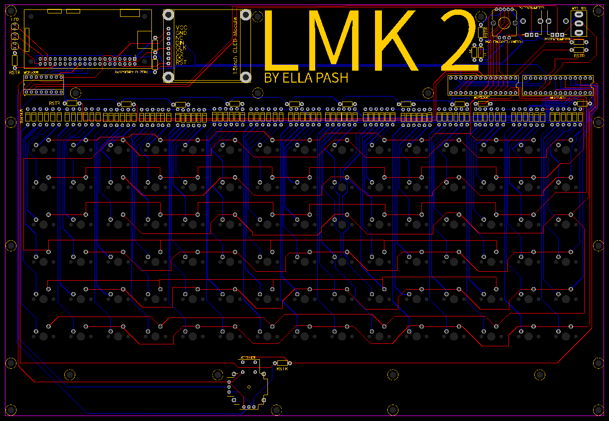

# LMK (Lyn Mechanical Keyboard) WORK IN PROGRESS
LMK is a "smart" mechanical keyboard built using a raspberry pi zero.

This project is a work in progress. I had hoped I would get it done over uni holidays but it got away from me. Currently I have a working prototype keyboard that sends keystrokes, runs arbitrary code, moves the mouse using a joystick, and generally does keyboard stuff. 

The case design needs to be improved. The hand wiring, although cheap and easy, is a lot messier and could be improved with a custom PCB. The software is very rough and needs better testing.

## Software
LMKLib is a software suite that sets up a RPI Zero as a "smart" keyboard. It is made up of 3 major parts:
- Usb Gadget
  - Configures the libcomposite linux module. Turns the rpi into a usb HID, ethernet adapter, and MIDI controller. 
- Hid-Interface
  - Abstracts the hid devices created by the linux kernel so that multiple programs my interface with them at once.
- Key-Server
  - Translates the GPIO into a keyboard layout that can be customized and controlled through RPC

The software suite functionality:
- json defined keyboard layouts
- runtime tweaking of keyboard settings through variables
- a module system that supports python and rust
  - GPIO drivers 
  - Key functionality expansion
  - custom HID outputs
- arbitrary code execution
- ethernet adapter emulation
  - direct ssh between the host and keyboard
- MIDI
  - acts as a usb midi controller
- RPC
- basic graphical interface

The repo of LMKLib can be found [here](https://github.com/ellabellla/lmklib)

There are also 2 scripting languages designed to program keyboard macros:
- [Ducky](https://github.com/ellabellla/ducky)
  - a lazy Ducky Script interpreter
- [Bork](https://github.com/ellabellla/bork)
  - a terse keyboard scripting language

## Hardware

[bom](pcb/BOM_Ortho90_2023-07-25.csv)

## License
This software is provided under the MIT license. Click [here](./LICENSE) to view.
