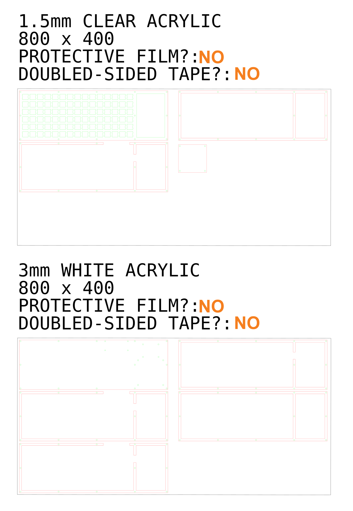
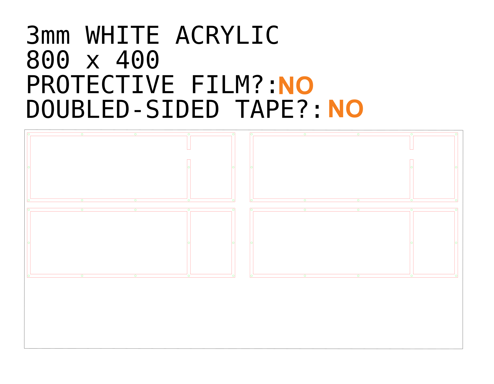

# LMK (Lyn Mechanical Keyboard) WORK IN PROGRESS
LMK is a "smart" mechanical keyboard built using a raspberry pi zero.

This project is a work in progress. I had hoped I would get it done over uni holidays but it got away from me. Currently I have a working prototype keyboard that sends keystrokes, runs arbitrary code, moves the mouse using a joystick, and generally does keyboard stuff. 

The case design needs to be improved. The hand wiring, although cheap and easy, is a lot messier and could be improved with a custom PCB. The software is very rough and needs better testing.

## Software
LMKLib is a software suite that sets up a RPI Zero as a "smart" keyboard. It is made up of 3 major parts:
- Usb Gadget
  - Configures the libcomposite linux module. Turns the rpi into a usb HID, ethernet adapter, and MIDI controller. 
- Hid-Interface
  - Abstracts the hid devices created by the linux kernel so that multiple programs my interface with them at once.
- Key-Server
  - Translates the GPIO into a keyboard layout that can be customized and controlled through RPC

The software suite functionality:
- json defined keyboard layouts
- runtime tweaking of keyboard settings through variables
- a module system that supports python and rust
  - GPIO drivers 
  - Key functionality expansion
  - custom HID outputs
- arbitrary code execution
- ethernet adapter emulation
  - direct ssh between the host and keyboard
- MIDI
  - acts as a usb midi controller
- RPC
- basic graphical interface

The repo of LMKLib can be found [here](https://github.com/ellabellla/lmklib)

There are also 2 scripting languages designed to program keyboard macros:
- [Ducky](https://github.com/ellabellla/ducky)
  - a lazy Ducky Script interpreter
- [Bork](https://github.com/ellabellla/bork)
  - a terse keyboard scripting language

## Hardware

### Case & Layout
The layout was designed using [keyboard-layout-editor.com](http://www.keyboard-layout-editor.com/#/) and then imported into [swillkb Plate & Case Builder](http://builder.swillkb.com/) in order to generate the case layers.

The layout can be found [here](./layout.json).

I then used Inkscape to modify the generated layers to include a side panel for the screen and auxiliary inputs, and added mounting points for the RPI and side panel. The design was then layed out into a laser cuttable file per the requirements of [Make Workshop](https://makemodels.com.au/workshop/), the laser cutting service I used.

### Wiring 
The keyboard was hand soldered following this [tutorial](https://geekhack.org/index.php?topic=87689.0). The switch matrix was then hooked up to 2 [MCP23017s](https://core-electronics.com.au/mcp23017-i2c-16-input-output-port-expander.html) and wired to the RPI zeros i2c bus.

A [Waveshare 1.5 Inch OLED Display Module](https://www.waveshare.com/wiki/1.5inch_OLED_Module) was also wired to the RPI zeros i2c bus. This required 2 resistors on the module to be resoldered, so that it would enter i2c mode.

A [MCP3008](https://core-electronics.com.au/mcp3008-8-channel-10-bit-adc-with-spi-interface.html) was connected over the RPI zeros SPI interface.

Auxillary inputs were then connected to the remaining pins on the [MCP23017s](https://core-electronics.com.au/mcp23017-i2c-16-input-output-port-expander.html) and [MCP3008](https://core-electronics.com.au/mcp3008-8-channel-10-bit-adc-with-spi-interface.html).

Auxillary inputs:
- [Potentiometer](https://core-electronics.com.au/rotary-potentiometer-10k-ohm-linear.html)
- [Joystick](https://www.jaycar.com.au/arduino-compatible-x-and-y-axis-joystick-module/p/XC4422)
- [toggle switch](https://core-electronics.com.au/mini-panel-mount-spdt-toggle-switch.html)

## License
This software is provided under the MIT license. Click [here](./LICENSE) to view.
